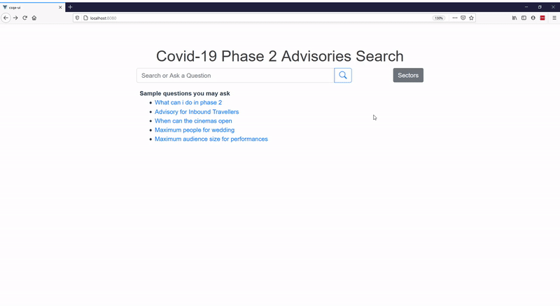

# covid19-search-and-qa
Covid-19 Advisories Search and Question Answering with Transformers.

Search and question answering system for [Covid-19 Phase 2 Sector-Related Advisories](https://www.moh.gov.sg/covid-19/phase-2-sector-related-advisories).
A mini project to try out document question answering with transformers using [Haystack](https://github.com/deepset-ai/haystack) and [FastAPI](https://github.com/tiangolo/fastapi).

## Show me what it does!
1. Search and Question Answering

2. Search and Question Answering Filtered by Sector

## What's so good about this?
In the current state of the new normal, official announcements and advisories provide guidelines of how we can resume our daily activities safely. However, there is simply too many documents covering various aspects of our daily lives and businesses. FAQ documents may help to highlight key points but it is often time consuming to create and may not have a comprehensive coverage.

With [Haystack](https://github.com/deepset-ai/haystack), we are able to use [pretrained transformer models](https://huggingface.co/deepset/roberta-base-squad2) to read the content of the advisories and provide relevant answers to user queries, **directly retrieving relevant answers from the documents** itself instead of relying on manually curated FAQs.

## What's in this project?
There are 3 components in this project.
1. `crawl.py` - Script to crawl, process and ingest the documents from [Covid-19 Phase 2 Sector-Related Advisories](https://www.moh.gov.sg/covid-19/phase-2-sector-related-advisories) to Elasticsearch.
2. `csqa-api` - A [FastAPI](https://github.com/tiangolo/fastapi) app that provides the search and question answering APIs.
3. `csqa-ui` - A [Vue.js](https://vuejs.org/) app that provides UI for search and question answering.

## How to run it?

### 1. Setup Python Environment
- Install gcc `sudo apt-get install gcc python3-dev`. Required due to psutil.
- Create an environment for the project. `conda create -n csqa python=3.7`
- Run `conda activate csqa`
- Install libraries `pip install -r requirements.txt`

### 2. Get Apache Tika 
- Download Apache Tika Server from [here](https://www.apache.org/dyn/closer.cgi/tika/tika-server-1.24.1.jar)
- Ensure you have java 8 installed before running.

### 3. Build Your UI
- Install node modules `yarn install`
- Build for deployment `yarn build`

### 4. Run Everything!
1. Start Elasticsearch (with docker).
    
    a. Without pre-crawled data
    - Run `docker run -p 9200:9200 -e "discovery.type=single-node" docker.elastic.co/elasticsearch/elasticsearch:7.6.2`
        
    b. With pre-crawled data You may use the pre-crawled index by running with volume. 
    - Download Elasticsearch index with pre-crawled data [here](https://drive.google.com/file/d/12FDd09Ehg_6fVwG2TD-qAqxVrrPe-Avr/view?usp=sharing) (last updated 9th Sep 2020).
    - Run `docker run -p 9200:9200 -e "discovery.type=single-node" -v <path to downloaded data folder>:/usr/share/elasticsearch/data docker.elastic.co/elasticsearch/elasticsearch:7.6.2`

3. Run tika (if you are running `crawl.py`)

    a. Run `java -jar tika-server-1.24.1.jar`

2. Run crawler (if you are not using the pre-crawled index)

    a. Run `python crawl.py`

3. Start the FastAPI app

    a. Run `python app.py`

4. Start your UI

    a. Run `dist` folder in the web server of choice. (E.g. nginx, serve, apache http etc)